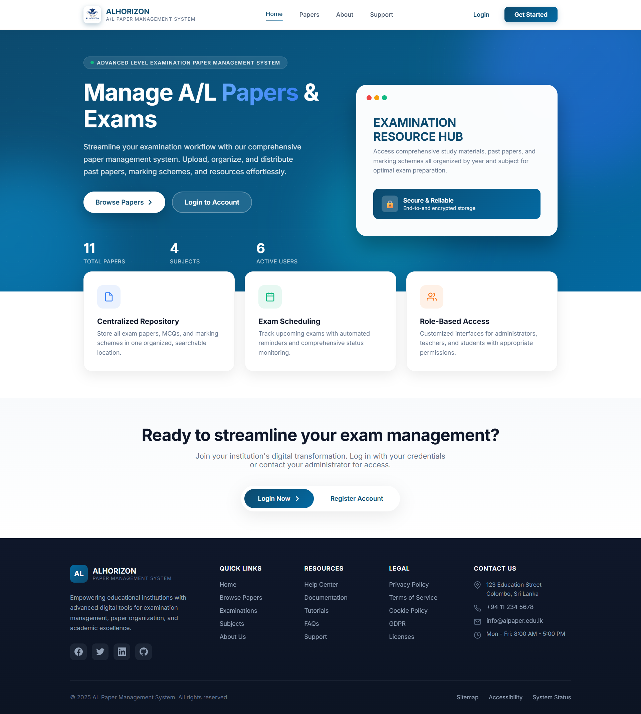
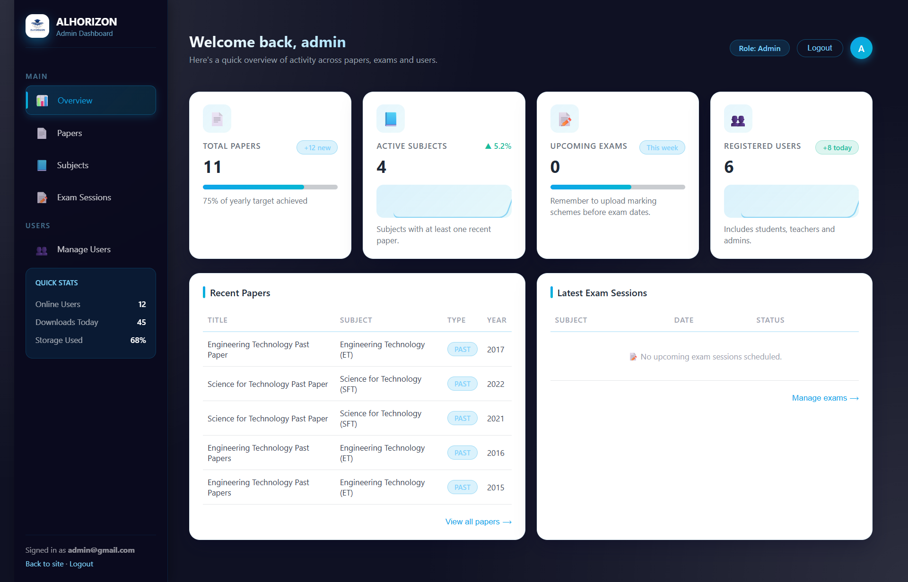
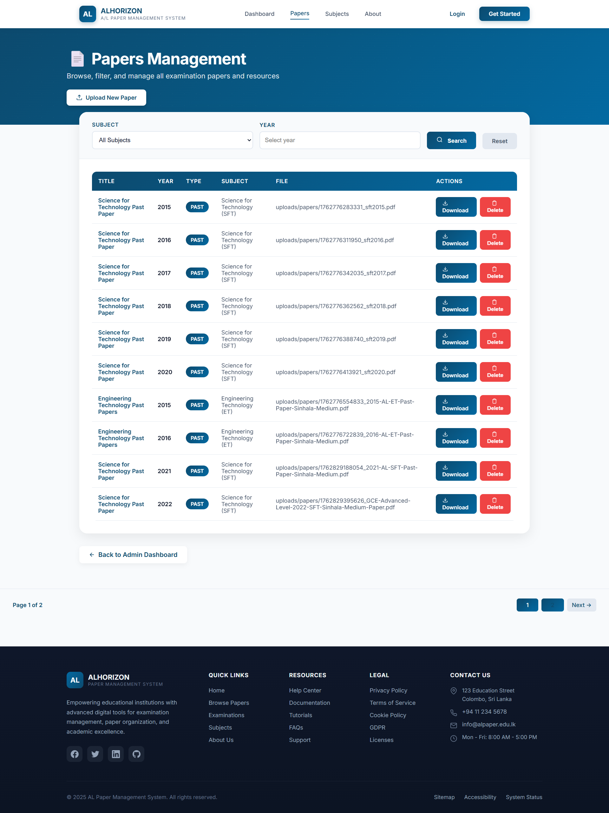
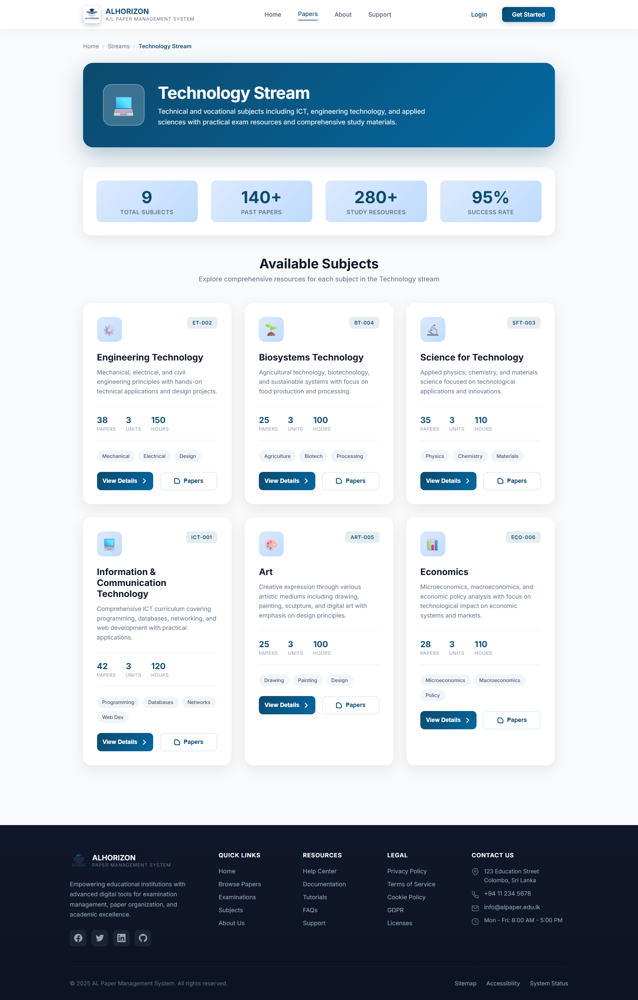
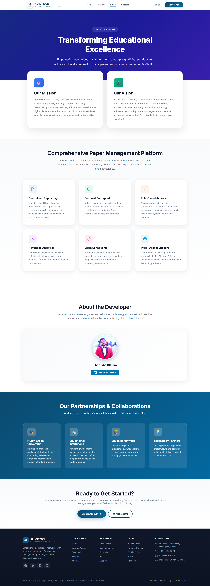

# 📘 A/L Paper Management System (ALPMS)

<div align="center">


[](https://spring.io/projects/spring-boot)
[](https://www.oracle.com/java/)
[](https://www.mysql.com/)
[](https://www.thymeleaf.org/)

**A comprehensive web-based Advanced Level (A/L) Examination Paper Management System built with Spring Boot and Thymeleaf**

[Features](#-key-features) • [Architecture](#-system-architecture) • [Installation](#️-setup-instructions) • [Usage](#-application-urls) • [Contributing](#-contributing)

</div>

---

## 📌 Project Overview

The **A/L Paper Management System (ALPMS)** is designed to revolutionize the way Advanced Level examination papers are managed, distributed, and accessed. This system eliminates the challenges of manual paper handling by providing a **centralized, secure, and role-based platform**.

### 🎯 Problem Statement
Traditional A/L paper management faces several challenges:
- Manual distribution of past papers and model papers
- Difficulty in organizing papers by subject, year, and type
- Limited accessibility for students
- No centralized tracking system for administrators

### ✨ Solution
ALPMS provides a comprehensive digital solution where:
- **Admins** can manage subjects, monitor papers, and oversee the entire system
- **Teachers** can upload and manage examination papers efficiently
- **Students** can browse, filter, and download papers with ease

The application follows a **layered Spring Boot architecture** ensuring scalability, maintainability, and security.

---

## 🚀 Key Features

### 🔐 Authentication & Authorization
- ✅ Secure login system powered by **Spring Security**
- ✅ **Role-based access control** (RBAC):
  - 👨‍💼 **Admin** - Full system access
  - 👨‍🏫 **Teacher** - Paper upload and management
  - 🎓 **Student** - Browse and download papers
- ✅ Secure logout with complete session invalidation
- ✅ Password encryption using BCrypt

### 🧑‍💼 Admin Module
- 📊 **Comprehensive dashboard** with real-time system statistics
- ➕ **Subject management** (Add / View / Delete)
- 📋 View and manage all uploaded papers across the system
- 🔍 Advanced filtering and search capabilities
- 📄 Pagination support for better performance
- 🎫 Support ticket management system

### 👨‍🏫 Teacher Module
- 📊 Personalized teacher dashboard
- 📤 **Easy paper upload** (PDF format supported)
- 🎯 Select subject, year, and paper type during upload
- 📑 View recently uploaded papers
- ✏️ Edit and delete own papers
- 📈 Track upload statistics

### 🎓 Student Module
- 🌊 Browse papers by **stream**:
  - 🔬 Science
  - 💻 Technology
  - 💼 Commerce
  - 🎨 Arts
- 📚 **Subject-wise paper collections** with organized views
- ⬇️ Secure paper download functionality
- 🔍 Advanced search and filtering options
- 📄 **Pagination** (6 papers per page in 3 × 2 grid layout)
- 📱 Responsive design for mobile and desktop

### 📨 Student Support System
- 💬 Students can submit support requests/queries
- 👁️ Admin and Teachers can view all support tickets
- 🔄 Update ticket status tracking:
  - 🟢 **OPEN** - Newly submitted
  - 🟡 **IN_PROGRESS** - Being addressed
  - ✅ **RESOLVED** - Completed
- 📧 Optional email notifications (configurable)

---

## 🏗️ System Architecture

The project follows a **Layered MVC Architecture** for separation of concerns:

```
┌─────────────────────────────────────────────────────────┐
│                    Presentation Layer                    │
│              (Thymeleaf Views - HTML/CSS/JS)            │
└─────────────────────┬───────────────────────────────────┘
                      │
┌─────────────────────▼───────────────────────────────────┐
│                   Controller Layer                       │
│            (Spring MVC - Request Handling)              │
└─────────────────────┬───────────────────────────────────┘
                      │
┌─────────────────────▼───────────────────────────────────┐
│                    Service Layer                         │
│              (Business Logic & Validation)              │
└─────────────────────┬───────────────────────────────────┘
                      │
┌─────────────────────▼───────────────────────────────────┐
│                  Repository Layer                        │
│         (Spring Data JPA - Data Access)                 │
└─────────────────────┬───────────────────────────────────┘
                      │
┌─────────────────────▼───────────────────────────────────┐
│                   Database Layer                         │
│                  (MySQL Database)                        │
└─────────────────────────────────────────────────────────┘
```

### 🎨 Architecture Highlights

| Component | Technology | Purpose |
|-----------|-----------|---------|
| **Presentation** | Thymeleaf, HTML5, CSS3, JavaScript | Server-side UI rendering and client interaction |
| **Controller** | Spring MVC | HTTP request handling and routing |
| **Service** | Spring Core | Business logic implementation |
| **Repository** | Spring Data JPA | Database operations and queries |
| **Security** | Spring Security | Authentication and authorization |
| **ORM** | Hibernate | Object-relational mapping |

---

## 🛠️ Technologies Used

### Backend
| Technology | Version | Purpose |
|------------|---------|---------|
|  | 17+ | Core programming language |
|  | Latest | Application framework |
|  | Latest | Web framework |
|  | Latest | Data persistence |
|  | Latest | Security framework |
|  | Latest | ORM framework |

### Frontend
| Technology | Purpose |
|------------|---------|
|  | Template engine |
|  | Markup language |
|  | Styling |
|  | Client-side scripting |

### Database
| Technology | Purpose |
|------------|---------|
|  | Relational database |

### Tools & Development
| Tool | Purpose |
|------|---------|
|  | Build automation |
|  | IDE |
|  | API testing |
|  | Version control |
|  | Code repository |

---

## ⚙️ Setup Instructions

### 📋 Prerequisites

Before you begin, ensure you have the following installed:
- ☕ **Java Development Kit (JDK) 17+**
- 📦 **Maven 3.6+**
- 🗄️ **MySQL 8.0+**
- 💻 **IDE** (IntelliJ IDEA recommended)
- 🌐 **Git**

### 🪜 Installation Steps

#### 1️⃣ Clone the Repository
```bash
git clone https://github.com/tha-rusha/Advaced-Level-Paper-Management-System-ALPMS-.git
cd Advaced-Level-Paper-Management-System-ALPMS-
```

#### 2️⃣ Configure MySQL Database
Create a new database:
```sql
CREATE DATABASE alpapers;
```

#### 3️⃣ Update Application Properties
Edit `src/main/resources/application.properties`:
```properties
# Database Configuration
spring.datasource.url=jdbc:mysql://localhost:3306/al_paper_db
spring.datasource.username=root
spring.datasource.password=""
spring.datasource.driver-class-name=com.mysql.cj.jdbc.Driver

# JPA/Hibernate Configuration
spring.jpa.hibernate.ddl-auto=update
spring.jpa.show-sql=true
spring.jpa.properties.hibernate.dialect=org.hibernate.dialect.MySQL8Dialect
spring.jpa.properties.hibernate.format_sql=true

# File Upload Configuration
spring.servlet.multipart.enabled=true
spring.servlet.multipart.max-file-size=10MB
spring.servlet.multipart.max-request-size=10MB

# Thymeleaf Configuration
spring.thymeleaf.cache=false
spring.thymeleaf.prefix=classpath:/templates/
spring.thymeleaf.suffix=.html

# Server Configuration
server.port=8080
```

#### 4️⃣ Build the Project
```bash
mvn clean install
```

#### 5️⃣ Run the Application
```bash
mvn spring-boot:run
```

Or run directly from your IDE by executing the main application class.

#### 6️⃣ Access the Application
Open your browser and navigate to:
```
http://localhost:8080
```

### 🔑 Default Login Credentials

After first run, you can create admin account or use these test credentials (if seeded):

| Role | Username | Password |
|------|----------|----------|
| Admin | admin@alpms.com | admin123 |
| Teacher | teacher@alpms.com | teacher123 |
| Student | student@alpms.com | student123 |

> ⚠️ **Security Note**: Change default passwords immediately in production environment.

---

## 📱 Application URLs

| Feature | URL | Access Level |
|---------|-----|--------------|
| 🏠 Home | `/` | Public |
| 🔐 Login | `/auth/login` | Public |
| 📝 Register | `/auth/register` | Public |
| 👨‍💼 Admin Dashboard | `/admin/dashboard` | Admin |
| 📊 Admin Papers | `/admin/papers` | Admin |
| 🎫 Admin Support | `/support/admin` | Admin |
| 👨‍🏫 Teacher Dashboard | `/teacher/dashboard` | Teacher |
| 📤 Upload Paper | `/teacher/upload` | Teacher |
| 👨‍🏫 Teacher Papers | `/teacher/papers` | Teacher |
| 🎓 Student Dashboard | `/student/dashboard` | Student |
| 📚 Browse Subjects | `/subjects` | Student |
| 📄 Browse Papers | `/papers` | Student |
| 🌊 Stream View | `/papers/stream` | Student |
| 💬 Submit Support | `/support` | Student |
| 🚪 Logout | `/auth/logout` | All Users |

---

## 📸 Screenshots

### 🏠 Home Page

*Modern landing page with easy navigation to all modules*

### 🔐 Login Page

*Secure authentication with role-based access control*

### 👨‍💼 Admin Dashboard

*Comprehensive overview with statistics and management options*

### 📚 Subject Management

*Easy-to-use interface for managing examination subjects*

### 👨‍🏫 Teacher Dashboard

*Teacher's control panel for paper uploads and management*

### 📤 Paper Upload

*Simple and intuitive paper upload interface*

### 🎓 Student View

*Clean grid layout for browsing and downloading papers*

### 💬 About Us

*Integrated help desk for student queries*

> 📝 **Note**: Add actual screenshots to a `screenshots/` folder in your repository root.

---

## 📊 Database Schema

### Key Entities

```sql
Users (id, username, email, password, role, created_at)
  ↓
Subjects (id, name, stream, description)
  ↓
Papers (id, title, subject_id, year, type, file_path, uploaded_by, upload_date)
  ↓
SupportTickets (id, student_id, subject, message, status, created_at, updated_at)
```

### Relationships
- **Users ↔ Papers**: One-to-Many (Teacher uploads multiple papers)
- **Subjects ↔ Papers**: One-to-Many (Subject has multiple papers)
- **Users ↔ SupportTickets**: One-to-Many (Student creates multiple tickets)

---

## 🔒 Security Features

- 🛡️ **Spring Security** integration
- 🔐 **BCrypt password encoding**
- 🎫 **JWT session management** (optional)
- 🚫 **CSRF protection** enabled
- 🔑 **Role-based authorization** at method level
- 📝 **SQL injection prevention** via JPA
- 🗂️ **Secure file upload** with validation
- ⏱️ **Session timeout** configuration

---

## 🚀 Future Enhancements

- [ ] 📧 Email notification system
- [ ] 📱 Mobile application (Android/iOS)
- [ ] 🔍 Advanced search with filters
- [ ] 📊 Analytics dashboard for admins
- [ ] 💾 Cloud storage integration (AWS S3)
- [ ] 🌐 Multi-language support
- [ ] 📈 Performance monitoring
- [ ] 🤖 AI-powered paper recommendations
- [ ] 💬 Real-time chat support
- [ ] 📅 Exam schedule management

---

## 🤝 Contributing

Contributions are welcome! Please follow these steps:

1. **Fork** the repository
2. **Create** a feature branch (`git checkout -b feature/AmazingFeature`)
3. **Commit** your changes (`git commit -m 'Add some AmazingFeature'`)
4. **Push** to the branch (`git push origin feature/AmazingFeature`)
5. **Open** a Pull Request

### 📝 Contribution Guidelines
- Follow Java coding conventions
- Write meaningful commit messages
- Add unit tests for new features
- Update documentation as needed
- Ensure code passes all tests

---

## 📄 License

This project is licensed under the **MIT License** - see the [LICENSE](LICENSE) file for details.

---

## 👥 Authors

- **Tharusha** - *Initial work* - [@tha-rusha](https://github.com/tha-rusha)

---

## 🙏 Acknowledgments

- Spring Boot team for the excellent framework
- Thymeleaf community for template engine
- All contributors who help improve this project
- Teachers and students who provided valuable feedback

---

## 📞 Contact & Support

- 🐛 **Report bugs**: [Open an issue](https://github.com/tha-rusha/Advaced-Level-Paper-Management-System-ALPMS-/issues)
- 💡 **Feature requests**: [Create a feature request](https://github.com/tha-rusha/Advaced-Level-Paper-Management-System-ALPMS-/issues)
- 📧 **Email**: support@alpms.com
- 🌐 **Website**: [ALPMS Official](https://alpms.com)

---

## ⭐ Show Your Support

Give a ⭐️ if this project helped you!

---

<div align="center">

**Made with ❤️ by Tharusha**

[](https://github.com/tha-rusha)
[](https://github.com/tha-rusha/Advaced-Level-Paper-Management-System-ALPMS-)

</div>

---

## 📚 Additional Resources

### Documentation
- [Spring Boot Documentation](https://docs.spring.io/spring-boot/docs/current/reference/html/)
- [Spring Security Reference](https://docs.spring.io/spring-security/reference/)
- [Thymeleaf Documentation](https://www.thymeleaf.org/documentation.html)
- [MySQL Documentation](https://dev.mysql.com/doc/)

### Tutorials
- [Building REST APIs with Spring Boot](https://spring.io/guides/tutorials/rest/)
- [Spring Security Tutorial](https://spring.io/guides/topicals/spring-security-architecture)
- [Thymeleaf with Spring](https://www.thymeleaf.org/doc/tutorials/3.0/thymeleafspring.html)

---

**Last Updated**: December 2024
